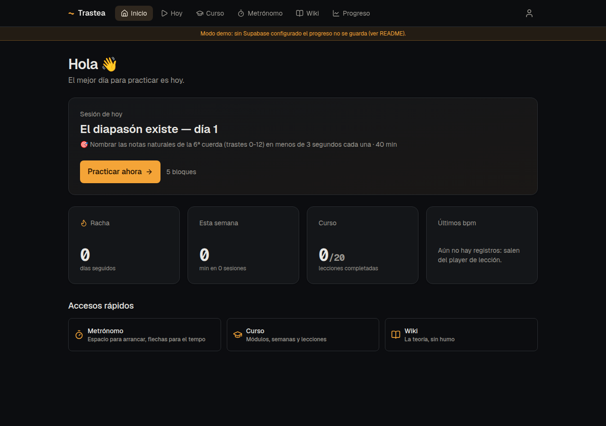
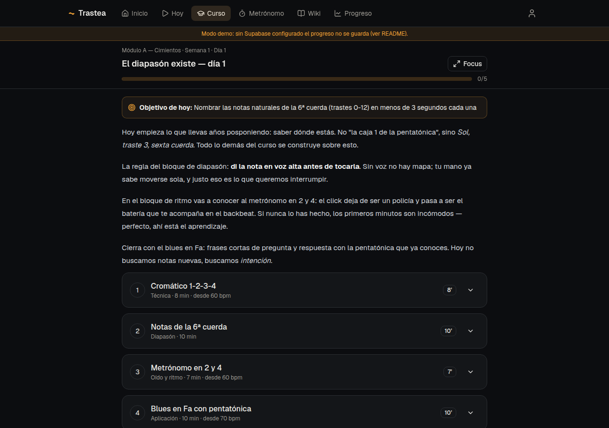
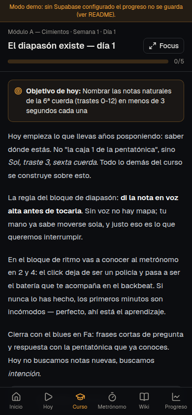
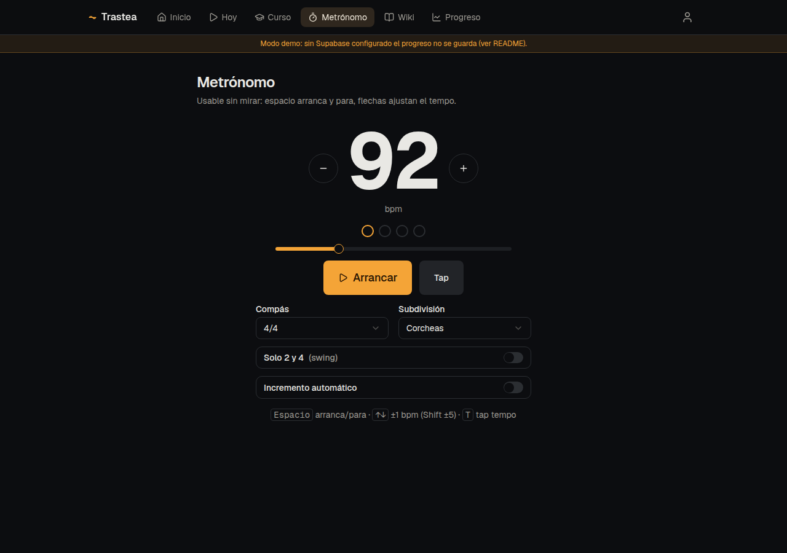
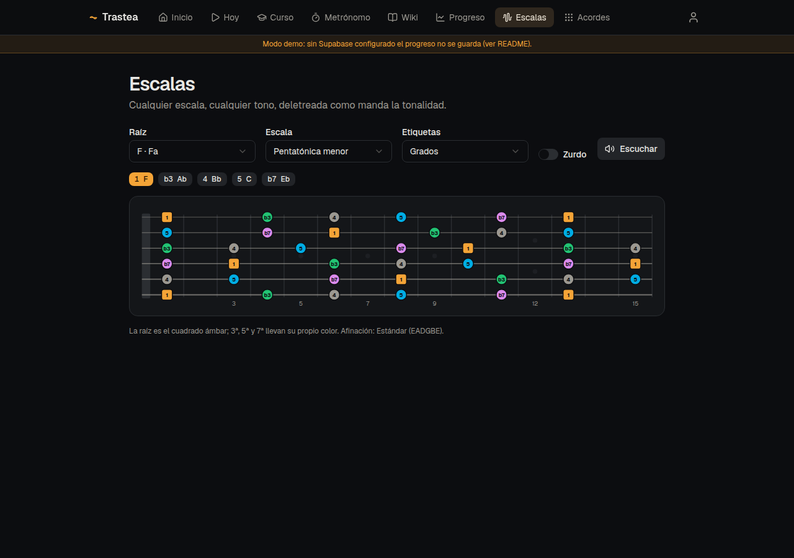

# Trastea 🎸

Tu sistema de estudio de guitarra: curso diario por lecciones, sesión de
práctica con timer y metrónomo, escalas y acordes visuales, wiki de teoría y
registro de progreso. El nombre juega con _trastes_ y _trastear_: cercana y
juguetona en los textos, seria y precisa como herramienta.



---

## Índice

- [Qué hace](#qué-hace)
- [Setup en 5 minutos](#setup-en-5-minutos)
- [Cómo se usa](#cómo-se-usa)
- [Comandos](#comandos)
- [Arquitectura](#arquitectura)
- [El sistema de contenido](#el-sistema-de-contenido)
- [Calidad y forma de trabajar](#calidad-y-forma-de-trabajar)
- [Roadmap](#roadmap)

---

## Qué hace

| Módulo            | Ruta                                                    | Qué es                                                                                                                       |
| ----------------- | ------------------------------------------------------- | ---------------------------------------------------------------------------------------------------------------------------- |
| **Dashboard**     | `/`                                                     | Racha, minutos de la semana, progreso del curso, últimos bpm y accesos rápidos                                               |
| **Sesión de hoy** | `/hoy`                                                  | Atajo directo a la lección-día que te toca                                                                                   |
| **Curso**         | `/curso`                                                | 3 módulos · 12 semanas · 60 lecciones-día con player interactivo                                                             |
| **Metrónomo**     | `/metronomo?bpm=80&sig=4/4&sub=2&accent=24`             | Standalone y embebido en lecciones, con presets por URL                                                                      |
| **Escalas**       | `/escalas?root=F&type=minor-pentatonic&labels=interval` | Explorador con audio, deletreo correcto por tonalidad                                                                        |
| **Acordes**       | `/acordes?root=G&type=maj7&view=triads`                 | Diagramas verticales de todas las formas tocables (abiertas, cejilla, inversiones, tríadas por grupos de cuerdas), con audio |
| **Canciones**     | `/canciones`                                            | Repertorio del curso: propósito pedagógico, tono, referencias y en qué lecciones aparece                                     |
| **Entrenar**      | `/entrenar`                                             | SRS de notas del mástil: te pregunta lo que peor llevas, 5 minutos al día                                                    |
| **Wiki**          | `/wiki`                                                 | 48 fichas en profundidad con buscador: sonoridad, origen, canciones, estudio y errores comunes                               |
| **Evaluación**    | `/curso/[modulo]/evaluacion`                            | Cierre de módulo: quiz corregido en servidor, checklist de autoevaluación y grabación de la prueba real                      |
| **Grabaciones**   | `/grabaciones`                                          | Tus grabaciones con URL firmada: el espejo para comparar cómo tocabas hace tres meses                                        |
| **Progreso**      | `/progreso`                                             | Gráfica de bpm por ejercicio e historial de sesiones                                                                         |
| **Perfil**        | `/perfil`                                               | Nivel, lección actual, cierre de sesión                                                                                      |

El **estado de las herramientas vive en la URL**: cualquier lección puede
enlazar una configuración exacta (metrónomo a 70 bpm en 2 y 4, la pentatónica
de Fa con grados…) y tú puedes guardar o compartir esos enlaces.

---

## Setup en 5 minutos

```bash
pnpm install
cp .env.example .env.local   # rellena con tu proyecto de Supabase
pnpm dev                     # http://localhost:3000
```

> Sin `.env.local` la app arranca en **modo demo**: todo funciona pero el
> progreso no se guarda (lo verás avisado en una franja ámbar).

### Supabase (auth + progreso)

1. Crea un proyecto free en [supabase.com](https://supabase.com).
2. `Project Settings → API`: copia URL y la clave pública a `.env.local`
   (valen tanto la "publishable" nueva como la "anon" clásica):
   ```
   NEXT_PUBLIC_SUPABASE_URL=https://xxxx.supabase.co
   NEXT_PUBLIC_SUPABASE_PUBLISHABLE_KEY=sb_publishable_...
   ```
3. Aplica la migración: abre el **SQL Editor** del dashboard y pega el
   contenido de `supabase/migrations/20260826150000_initial.sql` (o usa el CLI:
   `supabase link && supabase db push`). Crea las 10 tablas con RLS por
   usuario, el trigger de perfil y el bucket privado de grabaciones.
4. `Authentication → Sign In / Up`: activa **Email**.
5. `Authentication → URL Configuration`:
   - **Site URL**: `https://tu-dominio.vercel.app`
   - **Redirect URLs**: añade `https://tu-dominio.vercel.app/**` y
     `http://localhost:3000/**` (el comodín cubre `/auth/confirm` y los
     previews). La app acepta tanto el enlace por defecto (`?code=`) como
     plantillas personalizadas (`?token_hash=&type=`), así que no hace falta
     tocar las plantillas de email.

> ¿Prefieres probar sin confirmar el correo? En `Authentication → Sign In / Up
→ Email` desactiva "Confirm email" y el registro entra directo.

### Vercel (deploy)

1. Importa el repo en [vercel.com](https://vercel.com) (framework: Next.js,
   preset por defecto; detecta pnpm solo).
2. Añade las dos variables de entorno `NEXT_PUBLIC_SUPABASE_URL` y
   `NEXT_PUBLIC_SUPABASE_PUBLISHABLE_KEY` en el proyecto.
3. Deploy. Después añade el dominio de producción a las Redirect URLs de
   Supabase Auth.

---

## Cómo se usa

### 1. Regístrate y haz el onboarding

Crea tu cuenta, indica tu nivel y Trastea te asigna la lección de inicio.
Puedes cambiar nivel y nombre cuando quieras desde `/perfil`.

### 2. Cada día: "Hoy" y a tocar

`/hoy` te abre directamente la lección que te toca. Cada lección-día son
~40 minutos en 5 bloques (técnica, diapasón, oído/ritmo, aplicación,
repertorio):



- Abre un bloque: tiene su **timer** con los minutos asignados, su ejercicio
  con instrucciones y, si toca, el **metrónomo embebido ya configurado**.
- En los bloques de técnica, apunta el **bpm alcanzado** al completar: es lo
  que alimenta tus gráficas de progreso.
- El botón **Focus** pone el bloque actual a pantalla completa: timer gigante
  y metrónomo, pensado para el atril y el móvil.
- **Completar lección** guarda la sesión de práctica, actualiza tu racha y te
  avanza a la lección siguiente.

En el móvil la navegación pasa a una barra inferior con targets grandes:



### 3. El metrónomo, con y sin mirar



- `Espacio` arranca/para · `↑/↓` o `+/-` ajustan ±1 bpm (con `Shift`, ±5) ·
  `T` tap tempo.
- Los puntos del compás son **editables**: pulsa un pulso para acentuarlo.
  También son el pulso visual mientras suena.
- **Solo 2 y 4** (swing), subdivisiones (corcheas/tresillos/semis) e
  **incremento automático** (+X bpm cada N compases hasta un tope).
- Todo el estado va a la URL: `/metronomo?bpm=92&sub=2&inc=4&every=8&max=120`
  es un preset compartible.
- El audio usa _lookahead scheduling_ sobre el reloj de WebAudio: no se
  desincroniza aunque el navegador vaya cargado.

### 4. Escalas y acordes



- Elige raíz, escala/acorde y etiquetas (notas, Do-Re-Mi, grados o nada).
- En acordes: **diagramas verticales clásicos** con número de traste, ordenados
  por las zonas del mástil (CAGED): abiertos, cejilla e inversiones; pestaña de
  **tríadas** por grupos de cuerdas (1-2-3, 2-3-4…). Cada forma se puede escuchar.
- **Escuchar** reproduce la escala ascendente o el acorde arpegiado.
- La raíz es el cuadrado ámbar (forma **y** color, apto para daltonismo);
  3ª, 5ª y 7ª llevan colores propios.
- El deletreo respeta la tonalidad: en Fa verás **Sib, no La#**.
- Modo zurdo con un switch.

### 5. Wiki y progreso

- La wiki son **48 fichas en profundidad** con buscador y filtros por categoría
  y nivel. Cada una te cuenta cómo suena, de dónde viene, en qué canciones la
  has oído, dónde cae en el mástil, **cómo estudiarla** (rutina con minutos y
  bpm) y los errores típicos — con enlaces que abren `/escalas`, `/acordes` o
  `/metronomo` ya configurados.
- Los artículos se enlazan entre sí (`[[interlinks]]`) y muestran "este
  artículo aparece en…" generado automáticamente desde las lecciones.
- `/progreso` dibuja la curva de bpm de cada ejercicio y tu historial de
  sesiones. Lo que se mide, mejora.

### 6. Evaluaciones de módulo

Cada módulo se cierra en `/curso/[modulo]/evaluacion`, con tres patas que pesan
lo mismo en la barra de progreso:

- **La teoría**: un quiz de opción múltiple. Las respuestas correctas **nunca
  viajan al navegador**: el cliente recibe las preguntas sin `answer` y la
  corrección ocurre en un server action. Intentos ilimitados.
- **Las manos**: un checklist de autoevaluación que se guarda según lo marcas.
- **La prueba real**: te grabas tocando el reto del módulo. Sin intentos
  perfectos: la gracia es tener el antes y el después.

Las grabaciones usan `MediaRecorder` (con fallback de códec para Safari) y se
suben a un bucket **privado** de Supabase Storage bajo `{tu-id}/…`, así que la
política de RLS solo te deja leer y borrar las tuyas. Al listarlas se generan
URLs firmadas de una hora. Todas juntas están en `/grabaciones`.

---

## Comandos

| Comando                                        | Qué hace                                                                        |
| ---------------------------------------------- | ------------------------------------------------------------------------------- |
| `pnpm dev`                                     | servidor de desarrollo                                                          |
| `pnpm e2e`                                     | E2E con Playwright (escritorio y móvil); arranca la app en producción           |
| `pnpm build` / `pnpm start`                    | build y servidor de producción                                                  |
| `pnpm test` / `pnpm test:watch`                | tests unitarios (Vitest + Testing Library)                                      |
| `pnpm lint` / `pnpm typecheck` / `pnpm format` | calidad                                                                         |
| `pnpm content:audit`                           | valida `/content` y regenera `content/STATE.md`                                 |
| `pnpm check`                                   | lint + typecheck + test + content:audit — **debe estar verde antes de mergear** |

---

## Arquitectura

Stack: **Next.js 16 (App Router) + TypeScript estricto · Tailwind v4 +
shadcn/ui (vendorizado) · Supabase (Auth, Postgres+RLS, Storage) · Tone.js ·
MDX · Vitest**. Las decisiones están documentadas como ADRs cortos en
[`ARCHITECTURE.md`](ARCHITECTURE.md); las más importantes:

- **Tres capas de datos que nunca se mezclan**:
  1. _Datos de usuario_ → Supabase, RLS por `auth.uid()` en todas las tablas
     (`supabase/migrations/`).
  2. _Contenido educativo_ → MDX versionado en git (`/content`).
  3. _Datos musicales_ → fórmulas de intervalos en `/src/data`
     (`scales.ts`, `chords.ts`, `tunings.ts`). Las herramientas **calculan**
     posiciones; añadir una escala = añadir una entrada de datos.
- **Lógica pura separada del render y testeada**: teoría musical y enarmonías
  (`src/lib/music`), patrón del metrónomo (`src/lib/metronome/pattern.ts`),
  rachas (`src/lib/streak.ts`), posiciones de mástil
  (`src/lib/music/fretboard.ts`).
- **Audio con lookahead**: el motor (`src/lib/metronome/engine.ts`) agenda
  golpes por delante del tiempo real sobre el reloj de audio; la UI se
  sincroniza leyendo lo agendado. Jamás `setInterval` para sonido.
- **Modo demo sin credenciales**: sin variables de entorno todo renderiza y
  las acciones de guardado se convierten en no-ops avisados.

```
/content              curso, ejercicios, canciones, wiki, quizzes, seed
/supabase/migrations  SQL versionado (RLS en todas las tablas)
/scripts              content-audit.ts
/src
  /app                rutas (App Router); (app)=con navegación, (auth)=login
  /app/actions        server actions (progreso, sesiones, onboarding)
  /components         ui/ (shadcn), lesson/ (player), metronome/, fretboard/…
  /data               escalas/acordes/afinaciones por fórmula
  /lib/music          notas, intervalos, enarmonías, posiciones (puro)
  /lib/metronome      patrón (puro) + motor de audio + URL params
  /lib/supabase       clientes tipados + tipos del esquema
  /hooks              use-metronome, use-formula-player
```

---

## El sistema de contenido

El contenido es un sistema vivo con su propio tooling (ver
[`content/README.md`](content/README.md)):

- **Frontmatter validado con zod** (`src/lib/content/schemas.ts`). Un slug
  referenciado que no existe (ejercicio, canción, wiki, quiz, tool) pone el
  build **en rojo**, también en CI.
- **`pnpm content:audit`** genera [`content/STATE.md`](content/STATE.md):
  inventario, referencias rotas, semanas incompletas, artículos huérfanos.
- La unidad central es la **lección-día**: objetivo medible + 5 bloques con
  minutos, ejercicio, bpm y deep link a herramienta. El player la renderiza
  interactiva.
- El bucle de iteración vive en las skills de Claude Code
  (`.claude/skills/`): `/content-curator` lee `STATE.md`, propone el
  siguiente lote y lo genera con las convenciones de `add-lesson`/`add-wiki`.
- Curso actual: **módulo A completo (4 semanas × 5 días)** generado desde
  [`content/seed/plan-guitarra-12-semanas.md`](content/seed/plan-guitarra-12-semanas.md);
  los módulos B y C del plan están en `content/BACKLOG.md`.
- Tabs solo de material propio o dominio público; las canciones con copyright
  enlazan a su fuente externa.

---

## Calidad y forma de trabajar

- **TDD** en la lógica: 56 tests cubren teoría musical (deletreo en las 12
  tonalidades), patrón del metrónomo, tap tempo, URL params, rachas y
  posiciones de mástil.
- TS `strict`, `any` prohibido (regla de ESLint), a11y reforzada
  (`eslint-plugin-jsx-a11y` en modo error).
- WCAG 2.1 AA como objetivo: teclado completo, foco visible, `aria-label` en
  posiciones del mástil, `prefers-reduced-motion`, raíz distinguible por
  forma además de color.
- CI (GitHub Actions): lint + typecheck + test + content:audit + build en
  cada push/PR.
- Configuración de Claude Code commiteada: `CLAUDE.md`, agentes
  (`code-reviewer`, `a11y-auditor`, `test-writer`), skills y hooks
  (`.claude/`), MCPs (`.mcp.json`).

---

## Roadmap

Ver [`ROADMAP.md`](ROADMAP.md). En corto: ✅ Fase 0 (fundación) y Fase 1
(MVP para practicar: curso módulo A + player + metrónomo + dashboard);
🔨 Fase 2: exploradores (hecho el v1), AlphaTab, SRS de notas del mástil,
módulos B y C; luego grabaciones, evaluaciones y comparativas.
